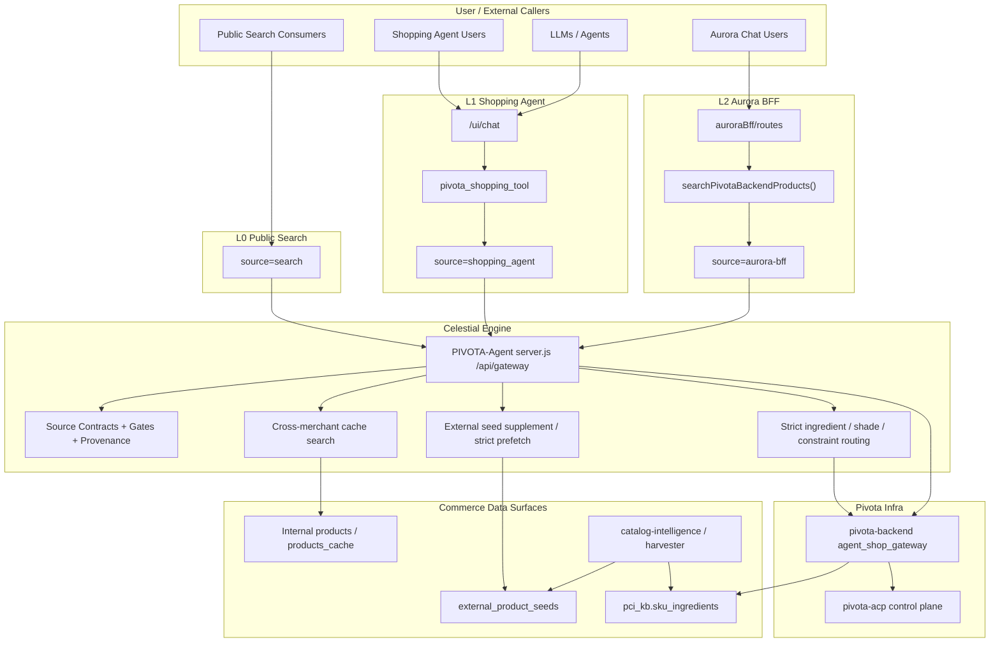

# Celestial Commerce Core Actual Architecture

This document describes the current implemented architecture for the Celestial commerce core as it exists in production-facing code today.

Use this as the comparison baseline against the longer-term Celestial planning diagram.

## Current Layered Topology

## Current Responsibility Split

### L0: `search`

- Public, stable, deploy-verifiable search surface.
- Internal-first and cache-stable by contract.
- Caller-supplied widening through `external_seed_strategy` is ignored.
- Still allowed to use strict runtime paths when the query contract requires strict behavior.

### L1: `shopping_agent`

- Canonical broad commerce retrieval contract.
- Owns shopping-oriented prompt understanding, clarify loops, query rewrite, and search invocation.
- Retrieval contract is `internal base + external supplement`.

### L2: `aurora-bff`

- Chat/BFF orchestration layer on top of the same commerce retrieval semantics as L1.
- Should differ from L1 in orchestration and rendering, not in the meaning of commerce retrieval.
- Current downstream search handoff is through `searchPivotaBackendProducts()` with `source=aurora-bff` by default, while still allowing explicit alignment to `shopping_agent`.

### L3: Celestial Engine

- Current implementation is mostly the shared runtime inside `PIVOTA-Agent`.
- This is where source contracts, production gates, provenance checks, cache-stage behavior, strict routing, and external seed supplement logic live today.
- It already behaves like the early Celestial engine layer, even if the long-term architecture may later separate it more formally.

## Current Request Paths

### Public search path

`source=search` -> `server.js` -> cross-merchant cache / strict route -> backend only if strict path requires it

Characteristics:

- stable
- internal-first
- override-resistant
- used by deploy verify and public smoke

### Shopping-agent path

`/ui/chat` -> `pivota_shopping_tool` -> `source=shopping_agent` -> `server.js` -> cache + supplement / strict path -> backend

Characteristics:

- broad commerce search
- query rewrite / loop-break support
- clarify when needed
- intended canonical product/merchant retrieval semantics

### Aurora-BFF path

`auroraBff/routes` -> `searchPivotaBackendProducts()` -> `source=aurora-bff` -> `server.js` -> cache + supplement / strict path -> backend

Characteristics:

- BFF orchestration
- commerce retrieval should align with L1
- response shaping and chat/card integration sit above retrieval

## What Is Already Stable

- `search` vs `shopping_agent` vs `aurora-bff` source contract is explicit.
- Public search cannot be widened by override params anymore.
- Broad commerce search on L1/L2 uses internal base plus external supplement.
- Strict ingredient/constraint routes are shared infrastructure, not separate product silos.
- Agent/backend provenance is externally checkable.
- Commerce-core production smoke now covers:
  - public search contract
  - broad search
  - strict ingredient consistency
  - merchant-style query routing
  - clarify-required behavior

## What Is Still Amber

- Shopping-agent prompt understanding is still only partially represented by stable live fixtures.
- Merchant-style routing is live-covered, but exact product lookup on `shopping_agent` is still too flaky for deterministic shared production smoke.
- Merchant vs product decomposition is not yet backed by one canonical live acceptance corpus.
- L1/L2 still share semantics by coordinated modules rather than a single reusable query-contract layer.

## Practical Drift Checks

If the implementation drifts from the long-term Celestial plan, it will usually show up in one of these places first:

- `source=search` starts acting like broad commerce search
- `shopping_agent` and `aurora-bff` return meaningfully different retrieval semantics for the same commerce query
- prompt/query decomposition logic moves deeper into prompts with no runtime helper coverage
- exact lookup or merchant routing silently falls back to generic upstream search
- source contracts stay documented but stop being enforced by live smoke
